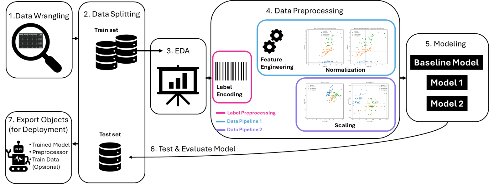
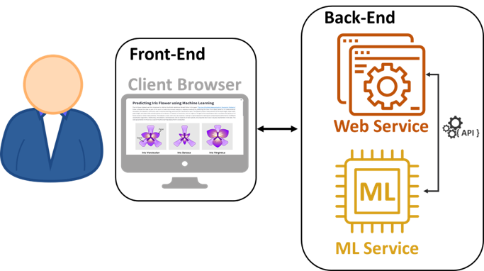
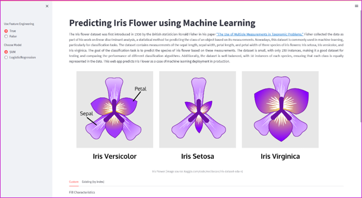
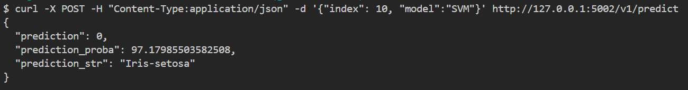
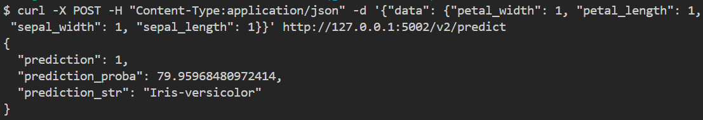
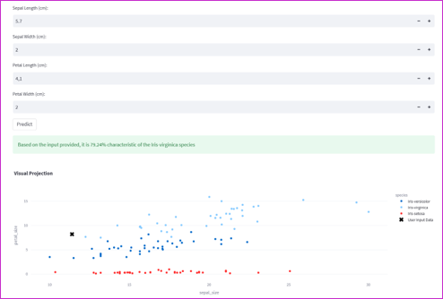
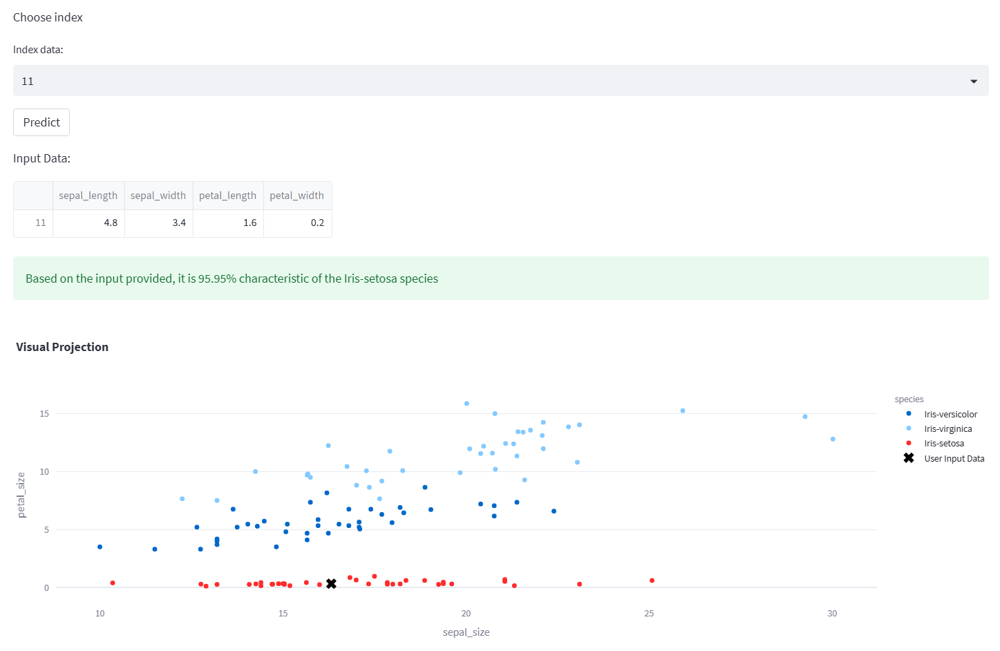

# End-to-End Machine Learning

## Project Description  

Here's a concise and clear project description based on the information you provided:

## Project Description

This project is a modification of the original repository, modified for guest-lecturer purposes. This project highlights the importance of building a robust machine learning pipeline that prevents data leakage and ensures reliable performance. Additionally, it showcases deployment practices by exposing the model via an API and integrating it into a user-friendly web app. 

To make the project more practical, it includes:
- Best practices for hiding sensitive information using an `.env` file.
- Simulated real-world functionality, where the app reads online data, generates user-friendly predictions, and stores the results.
- A Docker image for easy containerized execution.

This project serves as an example of how to develop and deploy machine learning models efficiently, with a focus on real-world usability.

Here’s a modified version of the objective for the current project:

## Objective

The objective of this project are:

- To build a machine learning pipeline, focus on preventing data leakage and several experimentations.
- To deploy the model via an API, with a web app designed to simulate real-world use, including online data input, user-friendly predictions, and saving the results.
- Apply best practices for securing sensitive information.
- To document the entire process, from pipeline development to deployment, for educational and future reference.
- To show how containerize the project using Docker (Opsional)

## Contents  

The repository contains the following files and directories:  
- `img/`: A directory containing supported images for README.md.
- `notebook/`: A directory containing jupyter notebook for model development.
- `src/`: A directory containing python scripts for prediction pipeline helper, build backend service, web app, and custom baseline predictor.
- `utils`: A directory containing objects for deployment purpose.
- `.dockerignore`: A file that list file/folder to ignore when build docker image.
- `.gitignore`: A file that list file/folder to ignore tracking by git.
- `docker-compose.yml`: A file to define and manage multi-container Docker applications, enabling simultaneous deployment (the API and web app).
- `dockerfile.api`: A Dockerfile to build the container for the backend API service.
- `dockerfile.web`: A Dockerfile to build the container for the web application.
- `README.md`: A markdown file describing the project
- `requirements.txt`:  Contains a list of important libraries for the project.

## Data  

This project uses the iris dataset, which is popular in machine learning. It can be found in [UCI Dataset](https://archive.ics.uci.edu/ml/machine-learning-databases/iris/iris.data). This data was chosen because it is quite simple since this project emphasizes the pipeline and deployment process rather than model development. Here is the Attribute Information of the data:

1. `sepal_length`: sepal length measurement of Iris flower in cm.
2. `sepal_width`: sepal width measurement of Iris flower in cm.
3. `petal_length`: petal length measurement of Iris flower in cm.
4. `petal_width`: petal width measurement of Iris flower in cm.
5. `class`: class of Iris flower (Iris Setosa, Iris Versicolour, Iris Virginica).

## Approach  

In this section, I will explain the two main parts of this project, i.e., Machine Learning Pipeline Development and related services in Production.

### Development Stage  

The development stage, as depicted in the flowchart, outlines the steps taken to prepare the data, experiment with different preprocessing pipelines, and evaluate models. All steps are executed within the Jupyter notebook located at `notebook/notebook.ipynb`. 

|  |
| :--: |
| Image 1: Development Flow Schema |

1. **Data Wrangling**: The first step involves collecting, inspecting, and simple cleaning the dataset.
   
2. **Data Splitting**: Next the data is split into training and testing sets. This is a critical step to prevent data leakage and ensure the model is evaluated on unseen data.

3. **Exploratory Data Analysis (EDA)**: Basic visualizations and statistics are generated to explore the data distribution, relationships, and any trends that may inform the preprocessing steps and model choice.

4. **Data Preprocessing**: 
   - Two distinct data pipelines are created for experimentation:
     - **Data-Pipeline 1**: All features are used, followed by scaling the data.
     - **Data-Pipeline 2**: Feature engineering is applied, modifying and adding features, and then the data is normalized.
   - Label encoding is applied for the target / label.

5. **Modeling**: 
   - The first data pipeline is used to establish a **Baseline Model** with a random predictor, which helps compare the performance of other models.
   - The proposed models, **Support Vector Machine (SVM)** and **Logistic Regression**, are trained on both Data-Pipeline 1 (scaled features) and Data-Pipeline 2 (engineered and normalized features). This results in a total of five models for evaluation:
     - Baseline (Random Predictor)
     - SVM (Data-Pipeline 1)
     - Logistic Regression (Data-Pipeline 1)
     - SVM (Data-Pipeline 2)
     - Logistic Regression (Data-Pipeline 2)

6. **Test & Evaluate Model**: Each model is tested on the hold-out test set, and the performance is evaluated based on basic classification metrics like accuracy, precision, recall, f1-score, and confusion matrix to determine the most effective pipeline and model combination.

7. **Export Objects (for Deployment)**: The trained model, preprocessing steps, and optional test data are exported as objects, which will be used later for deployment in the API and web app.

### Production Stage  

Because it uses a microservice approach, in this production stage, there are 2 services: Machine Learning, and Web App Services. The schematic can be seen in the image below.

|  |
| :--: |
| Image 2: Microservice Architecture at Production Stage |

#### Machine Learning (ML)-API

The ML API service is built using the Flask framework. It leverages the power of Flask to handle incoming requests and deliver predictions based on a pre-trained model from the development stage. The module defines two API routes, each handling a specific type of request:

- `/v1/predict`, A route that retrieves existing data from a remote server and makes predictions based on that data.
- `/v2/predict`, A route that is used for making predictions on custom input data.

Basically, both routes do this process:
- Getting input data: the first route retrieve data from a remote server, and the second route be custom value based on the user input.
- Loading the Pipeline Object: The information about preprocessing and pre-trained model stored in pipeline.bin is loaded using joblib. The module returns the corresponding error message if the model file is not found or an error occurs during loading.
- Data Preprocessing: The retrieved input data underwent the same preprocessing process as during the development stage.
- Prediction: The preprocessed data is passed to the predict function, the results include the predicted class and its probability.
- Saving: Save the input data and prediction result to a csv file.
- Response: The module returns a JSON response containing the prediction results.

#### Web Service  

Web service in this project focuses on classifying Iris flowers using machine learning built with one simple _Main Page_.
- _Main Page_  
  The main page of the web service is where the Iris flower classification takes place. It begins with the Iris flower story, followed by tabs that provide users with two options: a custom prediction based on user-inputted characteristics or an existing prediction using an index from the dataset. Streamlit's intuitive interface allows users to switch between these options seamlessly using tabs. Also, user can choose the data pipeline and model they want to use by setting it in the left tab.
  |  |   
  | :--: |
  | Image 3: Web App Main Page Display |   

## Usage  

To use this project, follow these steps:

1. Clone this repository to your local machine: `git clone https://github.com/m-nanda/End-to-End-ML.git --branch guest-lecturer`

2. Go to the project folder in a terminal or command prompt
    ```bash
    cd End-to-End-ML
    ```

3. Create a virtual environment  
    ```bash
    python -m venv .venv
    ```

4. Activate virtual environment (windows)
    ```bash
    .venv/Scripts/activate
    ```

5. Install the necessary dependencies 
    ```bash
    pip install -r requirements.txt
    ```  
6. Create `.env` file to store credentials which at least contain:
    - `DATA_SOURCE_URL` $ \rarr $  link to access Iris Dataset 
    - `RANDOM_STATE` $ \rarr $ parameter that controls the random number generator
    - `DATA_PATH` $ \rarr $ path to store data prediction 
    - `SAVED_OBJECTS_PATH` $ \rarr $  path to save object for the API
    - `PREDICTION_FILE` $ \rarr $  a csv file used as a database to store prediction
    - `ML_API_V1` $ \rarr $ endpoint of ml prediction for existing data
    - `ML_API_V2` $ \rarr $ endpoint of ml prediction with custom input data

7. Run the notebook (`notebook\notebook.ipynb`) and save the objects at the end:

8. Run the ML-API
    ```bash
    python src\api.py
    ```

9. Run the Web App  
    ```bash
    streamlit run src\web.py
    ```

10. If want to laverage contanirization with Docker, run this command:
    ```bash
    docker-compose up --build
    ```

## Result  

1. Machine Learning Prediction
   To test the API, you can open the endpoint from the terminal with a token in the headers:
     - `curl -X POST -H "Content-Type:application/json" -d '{"index": 10, "model":"SVM"}' http://127.0.0.1:5002/v1/predict`  

     |  |  
     | :--: |  
     | Image 4: ML API Result in Terminal (`v1/predict`'s route) |

     - `curl -X POST -H "Content-Type:application/json" -d '{"data": {"petal_width": 1, "petal_length": 1, "sepal_width": 1, "sepal_length": 1}}' http://127.0.0.1:5002/v2/predict`  

     |  |
     | :--: |  
     | Image 5: ML API result in terminal (`v2/predict`'s route)|

4. Web App Use  
   The Web App runs on `http://localhost:8501`. Here is the display and prediction result example: 
     - Prediction result of user custom input on web 
    
     |  |
     | :--: |
     | Image 6: Web App Tab _Custom_ and Prediction Result |

     - Prediction result of existing data 
    
     |  |
     | :--: |
     | Image 7: Web App Tab _Exsting (by index)_ and prediction result |  

## License  

This project is released under the MIT License. You are free to use, modify, and distribute this code as you wish.